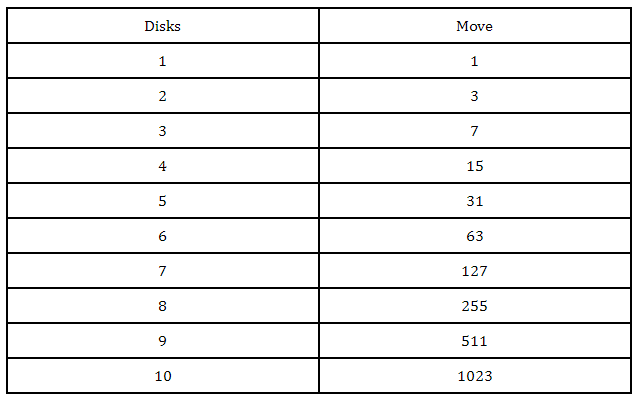

# Tower of Hanoi task - use of recursion

This repository contains Pylint exercises from CODIO. It was part of Module 3 (“Secure Software Development”) Unit 4 (Exploring Programming Language Concepts) of my MSc in Computer Science at the University of Essex, UK. The Tower of Hanoi puzzle was invented by the French mathematician Edouard Lucas in 1883. There is some pattern to the puzzle and with each increment in disks. Thus, the pattern can be followed recursively. 

### :paperclip: Tasks  

One of the classic programming problems that is often solved by recursion is the towers of Hanoi problem. A good explanation and walkthrough are provided by Cormen & Balkcom (n.d.) - the link is in the reading list. (the code they used for their visual example is provided on their website as well).

* Question 1: Read the explanation, study the code and then create your own version using Python (if you want to make it more interesting you can use asterisks to represent the disks). 
* Question 2:Create a version that asks for the number of disks and then executes the moves, and then finally displays the number of moves executed.
* Question 3:What is the (theoretical) maximum number of disks that your program can move without generating an error?
* Question 4:What limits the number of iterations? What is the implication for application and system security?

### :paperclip: My solution to Question 1  

Tower of Hanoi consists of three pegs or towers with n disks placed one over the other. The objective of the puzzle is to move the stack to another peg following these simple rules:
* Only one disk can be moved at a time.
* No disk can be placed on top of the smaller disk.

This is a classical example of Recursion (which happens when a function calls itself). I have created a version of Tower of Hanoi using asterisks to represent the disks. The number of steps exponentially increases every time I insert another disk in the stack: 



To move N disks from one peg to another, I need 2^N - 1. Thus, if N-1 > 1, then it's necessary to repeat this breakdown for smaller N until N-1 = 1. In short, the total number of moves required to solve the puzzle with N disks is 2^N - 1. 


### :paperclip: My solution to Question 2  


### :paperclip: My solution to Question 3  

[Python's default recursion limit is 1000](https://www.pythoncentral.io/resetting-the-recursion-limit/), meaning that Python won't let a function call on itself more than 1000 times, which for most people is probably enough. The limit exists because allowing recursion to occur more than 1000 times doesn't exactly make for lightweight code. If, however, you find yourself in need of a higher recursion limit, there is a way to override the default limit and reset it to a number of your choice. This isn't exactly recommended, because it can definitely slow your code down, but on the occasion that it needs to be done, here's how you can do it:

Let's say you want to set the limit to 1500. All you really need is to set a variable to 1500 followed by one line of code.

```
import sys
x=1500
sys.setrecursionlimit(x)
```

Remember: only take advantage of this method if it's absolutely essential.


### :paperclip: My solution to Question 4  


 Time complexity for the recursive solution:
The time complexity for the recursive solution of Tower of Hanoi is O(2^n), where n is the number of discs.


 
 
### Resources:

* Levy, Uri. The Magnetic Tower of Hanoi. Available from: https://arxiv.org/ftp/arxiv/papers/1003/1003.0225.pdf

* Mishra, Arpit. Tower of Hanoi recursion game algorithm explained. Available from: https://www.hackerearth.com/blog/developers/tower-hanoi-recursion-game-algorithm-explained/

